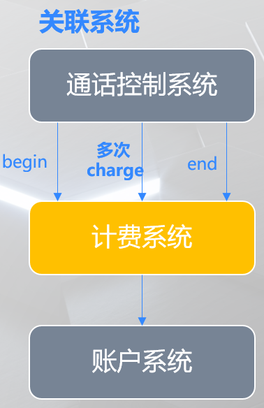

# 运营商计费系统
计费系统是一个典型的复杂问题场景，比较适合采用COLA架构，且发挥Domain层的价值。故将其作为COLA的另一个Sample。

运营商计费系统的需求如下：

运营商向用户提供电话服务，支持用户拨打/接听电话，并对通话收取费用。
如：主动拨打电话收取 0.5 元/分钟的通话费用；接听电话收取 0.4 元/分钟的通话费用。

运营商为了吸引客户，定义了若干电话套餐，总共有三种类型的套餐。我们要设计一个**计费系统**用于套餐计费规则的执行，保存计费记录，并通知**账户系统**扣减费用。

_注意：在一次通话过程中，通话控制系统可能会调用多次计费系统进行计费。_

- 基础套餐
    1. 主叫收费 0.5 元/分钟
    2. 被叫收费 0.4 元/分钟

- 固定时长套餐
    1. 套餐月固定费 100 元，包含：200 分钟主叫通话时间+200 分钟被叫接听时间
    2. 套餐外部分不再参与打折优惠，主叫 0.5 元/分钟，被叫 0.4 元/分钟

- 家庭套餐
    1. 套餐月固定费 20 元
    2. 用户可以指定 N 个号码作为自己的亲情号
    3. 用户接听/拨打亲情号均不收费
    4. 与亲情号之外的号码通话，主叫 0.5 元/分钟，被叫 0.4 元/分钟

# 系统设计
## 统一语言
我经常说，建模就是在分析语言，对于任何问题域，熟悉领域知识、理清概念、统一语言都是非常必要且重要的事情。
对于这个系统也不例外。

## 计费系统和周边系统的关系

